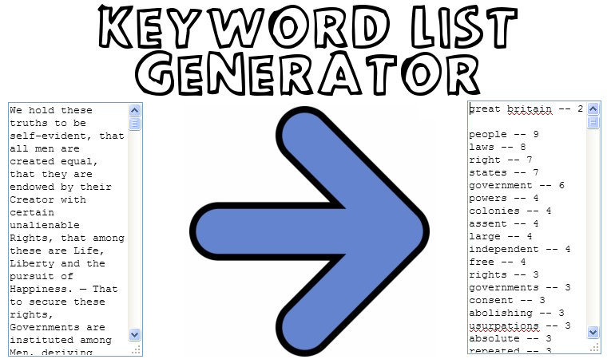

# Keyword List Generator

*You* provide the text.

*We* make a list of keywords from it.

## TOC

1. [TOC](#toc)
2. [Demo](#demo)
3. [Features](#features)
4. [Example Usage](#example-usage)
5. [Code Structure and Design](#code-structure-and-design)

## Demo

### Simple Demo

[Keyword List Generator (hosted at ListKeyWords.com)](http://www.listkeywords.com/)

Demo Instructions :

* Insert your source text into the input textarea.
* Observe the output textarea populate with your keyword data.

## Features

Keyword List Generator is packed with features.

* Ignores common words.
    * Ignoring common words is optional and controlled by a checkbox.
    * Ignored common words form a vast list of classes.
        * A hand-picked list of ~1,100, common words with little or no meaning on their own (such as "the", "at", "there", etc.).
        * Symbols and repeated symbols are excluded.
        * Numbers are excluded in these forms: 0001, 1), (1), [1], pp1, no1, pg1, one, first, firstly, first-ly, first'ly, i, i'th, ith, i-th, i-thly, i'thly.
        * Letters are excluded in these forms: a, a), (a), [a].
        * Onomatopoeia are excluded, for instance: aahhhh, ooooo, ohhhhh, haaaaa.
* Keywords may be sorted by most/least common.
* Input can be cleansed of HTML.
* Displaying Keyword counts can be enabled/disabled, to make for easy an copy/paste.
* Generates keyword phrases ("United States of America", etc.), as well as single keywords.
    * Keyword phrases is optional and controlled by a checkbox.
    * Phrases can be 2, 3, 4, 5, or 6 words long.
    * Phrases entirely composed of ignored words are also themselves ignored.

## Example Usage

### Example Usage Instructions

All you need to do is:

* Include the library
* Include elements that the library binds to, such as the ".input-area" and ".input-area" event handlers.
    * See the "Event and Element Handlers" section of the code in keyword-list-generator.js for more details on the selectors of these elements.

### Example Usage Code

~~~~
<table>
	<tr>
		<td valign="top">
			
<h4>Text to Find Keywords From</h4>

		</td>
		<td valign="top" width="80%">
			
<h4>Keywords from Provided Text</h4>

		</td>
	</tr>
	<tr>
		<td valign="top" width="80%">
			<textarea name="input-area" cols="50" rows="30" id="input-area" class="input-area">Type or copy-and-paste your text into this text box.</textarea>
		</td>
		<td valign="top" width="80%">
			<textarea name="output-area" cols="50" rows="30" id="output-area" class="output-area">Then your keywords list will appear in this text box.</textarea>
		</td>
	</tr>
</table>
~~~~

## Code Structure and Design

### Coding Languages

The entire project is coded in the following...

* *JavaScript* - For generating the keyword list from an input source.
* *jQuery* - For making the form elements responsive to the keyword generator.
* *CSS* - For stylizing the form for entering the keyword source.
* *HTML* - For providing the framework that the jQuery and CSS work upon.

### keyword-list-generator.js - Technical Overview

#### *Globals*

* **getTimeOutDelay()**
    * Get the delay of the timeout for typing.
* **getMaxOnomatopoeiaLength()**
    * Get the max length of an onomatopoeia to exclude from the keywords list.
* **processingText()**
    * Get the text to display when the keyword list generator is thinking.
* **waitingForUserText()**
    * Get the text to display when the keyword list generator is waiting.
* **getKeywordCountSeparator()**
    * Get the text that separates a keyword from its count.
* **getKeywordSeparator()**
    * Get the text that separates a keyword from another keyword.
* **getKeywordSectionSeparator()**
    * Get the text that separates a keyword section from other sections.

#### *Event and Element Handlers*

* **$('.input-area').keyup(function(e) {...})**
    * Run findKeywords() only after so much time has delayed from keyup movements.
* **$('.input-area').click(function(e) {...})**
    * Clear the input area of its default instruction set when input area is clicked.
* **$('.find-keywords-button').click(function(e) {...})**
    * User clicked the "Find Keywords" button.
    * Regenerate the keyword list.
* **$('.strip-html').click(function(e) {...})**
    * User changed the option of stripping HTML from the input.
    * Regenerate the keyword list.
* **$('.ignore-common-words').click(function(e) {...})**
    * User changed the option of ignoring common words in the keyword list.
    * Regenerate the keyword list.
* **$('.include-phrases').click(function(e) {...})**
    * User changed the option of including phrases in the keyword list.
    * Regenerate the keyword list.
* **$('.show-counts').click(function(e) {...})**
    * User changed the option of showing the keyword counts
    * Regenerate the keyword list.
* **$('#sort-order').change(function(e) {...})**
    * User changed the sort order of the keyword lists.
    * Regenerate the keyword list.
* **initiateApp()**
    * Clear the input area of its default instruction set.
    * Bound to many event handlers.

#### *Input Cleanup*

* **getInputWords()**
    * Get the input source for generating the keyword list.
* **cleanupInput(args)**
    * Cleanup the input from the user.
* **formatInput(args)**
    * Format the input from the user.
    * Specifically, lowercase and, if necessary, strip HTML.
* **getCleanupReplacements()**
    * Get text replacements for cleanup.
* **replaceBulk(args)**
    * Replace the cleanup replacements with their correct values.
* **getSkipWords()**
    * Get the common words to ignore.

#### *Keyword-Generation Logic*

* **findKeywords()**
    * Main function for finding the keywords.
* **getIgnoreKeywordsHash()**
    * Get a hash of all keywords to ignore.
* **findKeywordPhrases(args)**
    * Find the keyword phrases.  Return them in the order of longest phrases to shortest phrases.
    * For example: "Industrial Workers of the World", "Revolutionary Anarchist", etc..
* **getTwoWordPhraseCounts(args)**
    * Get 2-word phrase keywords.
* **getThreeWordPhraseCounts(args)**
    * Get 3-word phrase keywords.
* **getFourWordPhraseCounts(args)**
    * Get 4-word phrase keywords.	
* **getFiveWordPhraseCounts(args)**
    * Get 5-word phrase keywords.
* **getSixWordPhraseCounts(args)**
    * Get 6-word phrase keywords.
* **getSingleKeywordCounts(args)**
    * Get the counts of single keywords.
* **sortKeywords(args)**
    * Given keywords and their counts, sort them according to their counts.
* **displayKeywords(args)**
    * Given keyworsd and their counts, format them in a way that can be displayed.

#### *Primary World-List Builder*

* **getIgnoreKeywords()**
	* Get keywords to ignore.
    * If a keyword matches one of these, it will not show up in the final results.
	
#### *Secondary World-List Builders*

* **getIgnoreKeywords_multiplySymbols(args)**
    * Given a list of symbols, returns an array containing repeats of these symbols.
    * For example, -, --, ---,... *, **, ***.
* **getIgnoreKeywords_multiplySymbol(args)**
    * Given a symbol, return an array containing repeats of that symbol.
    * For example: -, --, ---, ----, -----, ------.
* **getIgnoreKeywords_zeroPadSymbols(args)**
    * Given a list of symbols, return an array of their zeropadded values.
    * For example: 2, 02, 002...., 09, 009, 0009.
* **getIgnoreKeywords_zeroPadSymbol(args)**
    * Given a symbol, return an array of multiply-zero-padded symbols of that symbol type.
    * For example: 1, 01, 001, 0001, 00001, 000001.
* **pad(n, width, z)**
    * Zero-pad or any-pad a string.
    * For example: 0000001.
* **getIgnoreKeywords_dashReplaceSpaces(args)**
    * Given an array of strings, replace all their spaces with dashes.
    * For example: nineteen, twenty, twenty-one, twenty-two, etc.
* **getIgnoreKeywords_allDecoratedNumberSymbols(args)**
    * Get all decorated number symbols for ignoring.
    * For example: no. 1, pp 2, -1-, *2*, etc..
* **getIgnoreKeywords_allDecoratedNumberSymbols_rightDecorations()**
    * Get all right-of-number decorated numbers for ignoring.
    * For example: (currently none).
* **getIgnoreKeywords_allDecoratedNumberSymbols_leftDecorations()**
    * Get all left-of-number decorated numbers for ignoring.
    * For example: pp1, pp2, no1, no2, etc..
* **getIgnoreKeywords_allNumberSymbols()**
    * Get all numbers for excluding.
    * For example: 1, 2, 3, 4, ... 99.
* **getIgnoreKeywords_allNumberPlaces()**
    * Get all number places for excluding.
    * For example: 1st, 1'th, 1-th, 2nd, 3rd, 4th, 5th, 6th, 7th, etc..
* **getIgnoreKeywords_allNumberPlaces_suffixes_common()**
    * Get the common suffixes for number-words.
    * For example: 4th, 5th, 6th, 7th, etc..
* **getIgnoreKeywords_allNumberPlaces_suffixes_uncommon(args)**
    * Get the uncommon suffixes for number-words.
    * For example: 1st, 2nd, 3rd.
* **getIgnoreKeywords_allNumberPlaces_appendSeparator(args)**
    * Get all combinations of a number of a suffix given all types of separators.
    * For example: 1-st, 1'st, 1 st.
* **getIgnoreKeywords_allNumberWordthlys()**
    * Get the "number-wordth-ly" list of ignore words.
    * For example: firstly, secondly, thirdly, etc..
* **getIgnoreKeywords_latinAlphabet()**
    * Get the latin alphabet to ignore.
    * For example: a, b, c, d, e, etc..
* **getIgnoreKeywords_latinAlphabetDecorated()**
    * Get a fully-decorated latin alphabet to ignore.
    * For example: a), b), c), -a-, -b-, -c-...
* **getIgnoreKeywords_latinAlphabetDecorated_decorateLetter()**
    * Decorate a letter with its variants.
    * For example a), a], a-, (a, {a, etc..
* **getIgnoreKeywords_latinAlphabetDecorated_decorateLetter_leftDecorations()**
    * Get the decorative items that appear to the left of decorated letters.
    * For example: (, [, {, *...
* **getIgnoreKeywords_latinAlphabetDecorated_decorateLetter_rightDecorations()**
    * Get the decorative items that appear to the right of decorated letters.
    * For example: ), ], }, *...
* **getIgnoreKeywords_latinAlphabetDecorated_decorateLetter_dualDecorations()**
    * Get the decorative items that appear to the left and right of decorated letters.
    * For example: **, --, [], {}, (), etc..
* **getIgnoreKeywords_romanNumerals()**
    * Get the Roman Numerals to ignore.
    * For example: iv, iv'ly, iv-ly, (iv), [iv], etc..
* **getIgnoreKeywords_romanNumerals_numbersOnly()**
    * Get a list of Roman numerals to ignore.
    * For example: i, ii, iii, etc..
* **getIgnoreKeywords_romanNumerals_mergeLists(args)**
    * Given two lists of roman numerals, merge them together.
    * For example: (i)x, (ii)x, (iii)x, (iv)x,... (ix)x. etc..
* **getIgnoreKeywords_onomatopoeia()**
    * Get the onomatopoeia to ignore.
    * For example: aahhh, oooo, ohhhhh, haaaa, etc..
* **getIgnoreKeywords_onomatopoeia_singles()**
    * Get the single-letter onomatopoeia to ignore.
    * For example: aaa, eeee, oooo, uuuuuu, etc..
* **getIgnoreKeywords_onomatopoeia_singles_list()**
    * Get the single-letter onomatopoeia list to ignore.
    * For example: a, aa, aaa, aaaa, aaaaa, etc..
* **getIgnoreKeywords_onomatopoeia_doubles()**
    * Get the double-letter onomatopoeia to ignore.
    * For example: ahhhhh, ohhhhhhh, eeeeeppppp, eeeekk, etc..
* **getIgnoreKeywords_onomatopoeia_doubles_list(args)**
    * Get the double-letter onomatopoeia list to ignore.
    * For example: ah, ahh, ahhh, ahhhh, ahhhhh, ahhhhhh, etc..
* **getIgnoreKeywords_allNumberWords()**
    * Get a list of number words.
    * For example: one, two, three, four...	
* **getIgnoreKeywords_allNumberWords_upToNinetyNine()**
    * Get all number words from one to ninety nine.
    * For example: one, two, three...twenty four, twenty five, twenty six, etc..
* **getIgnoreKeywords_allNumberWords_remainingDigits(args)**
    * Get the remaining digits to ignore.
    * For example: one thousand, fifty five hundred, seventy eight million, etc..
* **getIgnoreKeywords_allNumberWordths()**
    * Get numbereth words.
    * For example: first, second, third, fourth, etc..

#### *Secondary Word-Lists*

* **getIgnoreKeywords_allRightNumberDecorations()**
    * Get all symbols that typically decorate the right side of a number.
    * For example: (currently none)
* **getIgnoreKeywords_allLeftNumberDecorations()**
    * Get all symbols that typically decorate the left side of a number.
    * For example: pp, pg, no, etc..
* **getIgnoreKeywords_spaces()**
    * Get spaces to ignore.
    * For example: (weird UTF-8 spaces)
* **getIgnoreKeywords_simpleSymbols()**
    * Get a list of simple symbols which, themselves or multiples of, should never be listed as keywords.
    * For example: ., !, ?, @, :, ;, #, etc..
* **getIgnoreKeywords_advancedSymbols()**
    * Get a list of advanced symbols which behave largely like the simple symbols, except they are more exceptional.
    * For example: …, ?, ?, §, ¶, etc..
* **commonNumberSuffixes()**
    * Get a list of common number suffixes.
    * For example: th, as in "5th".
* **uncommonNumberSuffixes()**
    * Get a list of uncommon number suffixes.
    * These must be ordered accordingly: 0=>st ("1st"), 1=>nd ("2nd"), 2=>rd("3rd").
    * For example: 'st', 'nd', 'rd'.
* **numberSuffixSeparators()**
    * Get the separators found between a number and its suffix.
    * For example: "-" as in "5-th", or "'" as in "6'thly", etc..
* **getIgnoreKeywords_latinAlphabetDecorated_decorateLetter_dualDecorations_parts()**
    * Get decorator parts for latin letters.
    * For example: " as in "a", - as in -b-, * as in *c*, etc..
* **getIgnoreKeywords_allNumberWords_firstDigit()**
    * Get all, single-digit number words to ignore.
    * For example: one, two, three, four, etc..
* **getIgnoreKeywords_allNumberWords_upToTwenty()**
    * Get all number words up to twenty to ignore.
    * For example: ten, eleven, twelve, thirteen, etc..
* **getIgnoreKeywords_allNumberWords_upToNinetyNine_secondDigit()**
    * Get all number words second-digit increment to ignore and concat with others to ignore.
    * For example: twenty, thirty, forty, fifty, sixty, etc..
* **getIgnoreKeywords_allNumberWords_remainingDigits_baseIncrements()**
    * Get additional base increments for the "one to ninety" lists.
    * For example: hundred, thousand, million, etc..
* **getIgnoreKeywords_allNumberWordths_firstDigit()**
    * Get all number'th words of the first digit to ignore.
    * For example: first, second, third, fourth, fifth, sixth, etc..
* **getIgnoreKeywords_allNumberWordths_upToTwenty()**
    * Get all number'th words up to twenty to ignore.
    * For example: tenth, eleventh, twelfth, thirteenth, fourteenth, etc..
* **getRomanNumerals_firstDigitValues()**
    * Get the first digit (0-9) values for the Roman Numeral system.
    * For example: (nothing; i.e., zero), i, ii, iii, etc..
* **getRomanNumerals_secondDigitValues()**
    * Get the second digit (00-90) values for the Roman Numeral system.
    * For example: (nothing; i.e., zero), x (10), xx (20), xxx (30), etc..	
* **getRomanNumerals_thirdDigitValues()**
    * Get the third digit (000-900) values for the Roman Numeral system.
    * For example: (nothing; i.e., zero), c (100), cc (200), ccc (300), etc..
* **getRomanNumerals_fourthDigitValues()**
    * Get the fourth digit (0000-9000) values for the Roman Numeral system.
    * For example: (nothing; i.e., zero), m (1000), mm (2000), mmm (3000), etc..
* **getIgnoreKeywords_onomatopoeia_singleLetter()**
    * Get the single letter onomatopoeia letters.
    * Excluded words will be made from multiple strings of varying length of this concated letter, for instance: mmmm, uuuuuuuu, aa, ooo.
    * For example: a, e, m, o, u.
* **getIgnoreKeywords_onomatopoeia_doubleLetter()**
    * Get the doubl eletter onomatopoeia letters.
    * For example: [a,h] ("ahhhhh"), [e,k] ("eeeek"), [h,m] ("hhhhhmmmmmm"), [o,h] ("ohhhhhhhh"), etc..

#### *Master Words Ignore-List*

* **getIgnoreKeywords_allWords()**
    * Concat together the master-list of hand-chosen, common-words for exclusion.
* **getIgnoreKeywords_allWords_symbolWords()**
    * Get the common words to ignore that start with: a symbol.
* **getIgnoreKeywords_allWords_numberWords()**
    * Get the common words to ignore that start with: a number.
* **getIgnoreKeywords_allWords_A_Words()**
    * Get the common words to ignore that start with: A.
* **getIgnoreKeywords_allWords_B_Words()**
    * Get the common words to ignore that start with: B.
* **getIgnoreKeywords_allWords_C_Words()**
    * Get the common words to ignore that start with: C.
* **getIgnoreKeywords_allWords_D_Words()**
    * Get the common words to ignore that start with: D.
* **getIgnoreKeywords_allWords_E_Words()**
    * Get the common words to ignore that start with: E.
* **getIgnoreKeywords_allWords_F_Words()**
    * Get the common words to ignore that start with: F.
* **getIgnoreKeywords_allWords_G_Words()**
    * Get the common words to ignore that start with: G.
* **getIgnoreKeywords_allWords_H_Words()**
    * Get the common words to ignore that start with: H.
* **getIgnoreKeywords_allWords_I_Words()**
    * Get the common words to ignore that start with: I.
* **getIgnoreKeywords_allWords_J_Words()**
    * Get the common words to ignore that start with: J.
* **getIgnoreKeywords_allWords_K_Words()**
    * Get the common words to ignore that start with: K.
* **getIgnoreKeywords_allWords_L_Words()**
    * Get the common words to ignore that start with: L.
* **getIgnoreKeywords_allWords_M_Words()**
    * Get the common words to ignore that start with: M.
* **getIgnoreKeywords_allWords_N_Words()**
    * Get the common words to ignore that start with: N.
* **getIgnoreKeywords_allWords_O_Words()**
    * Get the common words to ignore that start with: O.
* **getIgnoreKeywords_allWords_P_Words()**
    * Get the common words to ignore that start with: P.
* **getIgnoreKeywords_allWords_Q_Words()**
    * Get the common words to ignore that start with: Q.
* **getIgnoreKeywords_allWords_R_Words()**
    * Get the common words to ignore that start with: R.
* **getIgnoreKeywords_allWords_S_Words()**
    * Get the common words to ignore that start with: S.
* **getIgnoreKeywords_allWords_T_Words()**
    * Get the common words to ignore that start with: T.
* **getIgnoreKeywords_allWords_U_Words()**
    * Get the common words to ignore that start with: U.
* **getIgnoreKeywords_allWords_V_Words()**
    * Get the common words to ignore that start with: v.
* **getIgnoreKeywords_allWords_W_Words()**
    * Get the common words to ignore that start with: W.
* **getIgnoreKeywords_allWords_X_Words()**
    * Get the common words to ignore that start with: X.
* **getIgnoreKeywords_allWords_Y_Words()**
    * Get the common words to ignore that start with: Y.
* **getIgnoreKeywords_allWords_Z_Words()**
    * Get the common words to ignore that start with: Z.
* **getIgnoreKeywords_allWords_nonEnglishWords()**
    * Get the common words to ignore that start with: a non-english character.
